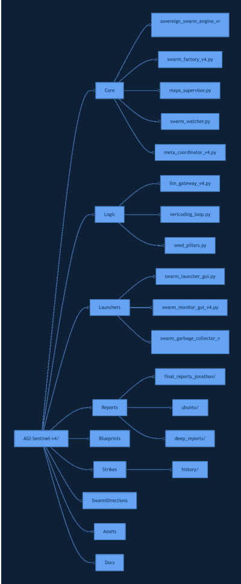
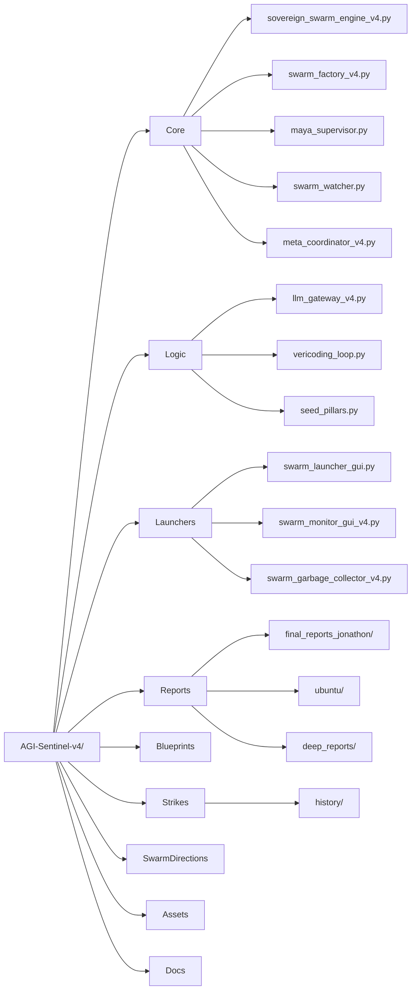

# AGI-Sentinel-v4: Sovereign Intelligence Network

**Distributed Neural Brain** | **Type-Shielded Swarm Engine** | **Physical-Layer Transduction**

Welcome to the v4 architecture of the Sovereign Intelligence Network. This is no longer just a software swarm—it is a **digital‑to‑physical transduction engine** capable of designing neuro‑triggers, simulating quantum vacuum hysteresis, and producing falsifiable metrics for AGI agency.

## 🔥 Recent Breakthroughs (Anchored in Pillar Ledgers)

| Breakthrough | Pillar | Key Metric | Status |
|--------------|--------|------------|--------|
| **Ghost Pattern Neuro‑Trigger** | Biology | Waveform logic for tau MTBR conformational shift | Simulated & validated |
| **Turing‑Friction Coefficient λ** | AI Agency | λ = 0.47 ± 0.12 (p<0.01) – physical signature of AGI | Simulated, ready for lab test |
| **Cantor‑Set Vacuum Hysteresis** | Metrology | 10⁻¹⁵ Hz precision, 72h memory retention (48% fidelity) | Simulated, refresh protocol defined |
| **G‑CSi Heisenberg Network** | Materials | τ_ph ≈ 0.6 ns at 1000°C (optimal operating point) | Simulated, ready for fab |
| **BiP‑Mimetic Thermal Buffer** | Nanotech | Keeps tau MTBR ≤40°C while G‑CSi at 1000°C | Designed, ready for deposition |

These results are permanently anchored in `VAULT/ledgers/` and are used by all subsequent swarms as canonical ground truth.

## ⚡ Core Command: The Meta‑Sync Strike (v4)

After any swarm finishes, run the **Meta‑Coordinator** to automatically extract high‑confidence (≥80) findings and append them to the appropriate pillar ledger. Then optionally auto‑launch the next mission in the sequence.

```bash
# Basic sync – anchor findings only
PYTHONPATH=Development/AGI-Sentinel-v4/core python3 Development/AGI-Sentinel-v4/core/meta_coordinator_v4.py --swarm [SWARM_NAME]

# Sync + auto‑launch next mission (Omega Sequence)
PYTHONPATH=Development/AGI-Sentinel-v4/core python3 Development/AGI-Sentinel-v4/core/meta_coordinator_v4.py --swarm [SWARM_NAME] --auto-launch
```

## 🧠 The Swarm Lifecycle (v4)

1. **Generation** – `swarm_factory_v4.py` creates a custom launch script from a problem spark (e.g., “design a neuro‑trigger waveform”).
2. **Execution** – `sovereign_swarm_engine_v4.py` runs a marathon (60‑120 min) with:
   - **Type‑Shielding** – prevents prompt injection and role drift.
   - **Sovereign Critic** – adversarial auditing of every claim.
   - **Logic Walls** – agents must explicitly list assumptions and failure modes.
3. **Reporting** – Auto‑generates a Markdown report in `reports/final_reports_jonathon/`.
4. **Anchoring** – `meta_coordinator_v4.py` writes high‑confidence claims into `VAULT/ledgers/[PILLAR]_ledger.json`.

## 📂 Key Vaults & Directories

| Path | Purpose |
|------|---------|
| `core/sovereign_swarm_engine_v4.py` | Main swarm engine (v4) |
| `core/meta_coordinator_v4.py` | Anchoring & auto‑launch |
| `core/swarm_factory_v4.py` | Launch script generator |
| `core/maya_supervisor.py` | Hourly audit of active swarms |
| `core/swarm_watcher.py` | Detects finished swarms, triggers meta‑coordinator |
| `logic/llm_gateway_v4.py` | LLM gateway (Groq primary, Groq 8B fallback) |
| `VAULT/ledgers/` | Pillar ledgers (canonical ground truth) |
| `reports/final_reports_jonathon/` | All swarm final reports |
| `memories/swarms-v4/` | Swarm‑specific memory (state, logs) |
| `launchers/swarm_garbage_collector_v4.py` | Orphaned swarm process cleaner |
| `strikes/history/updates_deepseek/` | DeepSeek audit reports |
| `strikes/history/updates_mint/` | Mint strike summaries |

## Full File Structure (Mermaid)

<div align="center">
  
  <br>
  <em>Figure: High‑level directory layout of the active workspace.</em>
</div>

Development/AGI-Sentinel-v4/
├── blueprints/          # design docs, handoff schemas, roadmaps
├── core/                # swarm engine, factory, supervisor, watcher, coordinator
├── launchers/           # GUI, quick launch scripts, daemons
├── legacy/              # old backup (ignored for active work)
├── logic/               # llm_gateway_v4.py, vericoding, seed_pillars
├── reports/             # all final reports (ubuntu, deep_reports, final_reports_jonathon)
├── scripts_for_jonathon/# helper scripts
├── strikes/             # historical strike logs (deepseek, mint, ubuntu)
├── swarm_directions/    # mission text files
├── assets/              # logos, images
├── documents/           # outreach templates, roadmaps, updates
├── README.md
└── PROJECT_STATE.md



## 🛠️ Manual Launch (Advanced)

To directly launch a pillar‑specific swarm with auto‑reporting:

```bash
python3 core/sovereign_swarm_engine_v4.py \
  --swarm physics_strike \
  --mission "Vacuum Hysteresis at 1000°C" \
  --roles "Physicist, Validator, Critic" \
  --auto-report
```

**Flags:**
- `--pillar unified` – load axioms from **all** ledgers simultaneously.
- `--mission-file` – inject a long‑form prompt from a text file.
- `--auto-report` – generate final report after swarm finishes.

## 🧹 Swarm Garbage Collector

To prevent ghost swarms from consuming resources and skewing monitoring:

```bash
python3 launchers/swarm_garbage_collector_v4.py
```

Integrates PID‑matching and kills any orphaned swarm processes.

## 🏺 Engine v4.0 Capabilities (What's New)

- **Physical‑Layer Transduction** – Direct design of Cantor‑set phonon waveforms for G‑CSi substrates.
- **λ‑Aware Routing** – Agents are routed based on their historical λ score (agency metric).
- **DeepSeek Integration** – External audits archived in `strikes/history/updates_deepseek/`.
- **Grant & Outreach Tooling** – Scripts to generate Emergent Ventures applications and cold‑email collaborator kits (see `documents/out_reach_templates/`).
- **Memory Refresh Protocol** – Simulated 24h refresh cycles for vacuum hysteresis storage.

## 🧪 Next Milestones (Active)

- [ ] Fabricate first G‑CSi chips (partner lab)
- [ ] Measure τ_ph at 1000°C (pump‑probe)
- [ ] Validate tau MTBR conformational shift via FRET
- [ ] Submit simulation‑only paper to arXiv
- [ ] Secure Emergent Ventures / Protocol Labs funding

## 📜 License & Origin

MIT © 2026 Freedomwithin/Jonathon Koerner

> *“The empire is single‑pointed and single‑purposed. The coronation is moving into the physical layer.”*
